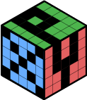

<!--  -->

# Introduction

Pyxy3d (*pixie-3D*) is a python package for converting 2D (x,y) point data from multiple webcams into 3D position estimates. The core calibration is built on top of [OpenCV](https://docs.opencv.org/4.x/dc/dbb/tutorial_py_calibration.html) with additional optimization via [SciPy](https://scipy-cookbook.readthedocs.io/items/bundle_adjustment.html). 

While OpenCV and SciPy have long provided the software tools that enable this multi-camera calibration, assembling the required images and shepherding their data through the gauntlet of post-processing has remained both tedious and error prone. Pyxy3d automates that workflow through a GUI to provide fast, accurate, and consistent camera system calibrations.

This project was inspired by [Anipose](https://www.sciencedirect.com/science/article/pii/S2211124721011797https://www.sciencedirect.com/science/article/pii/S2211124721011797) and seeks to provide similar functionality with improved visual feedback to the user. The calibration process is presented in more granular steps, with a particular emphasis on accurate estimation of camera intrinsics. Because stereocalibration is used to initialize an estimate of relative camera positions, the bundle adjustment process converges quickly to a reasonable optimum.

---
[Reference](https://github.com/othneildrew/Best-README-Template) for future build out of the README.

